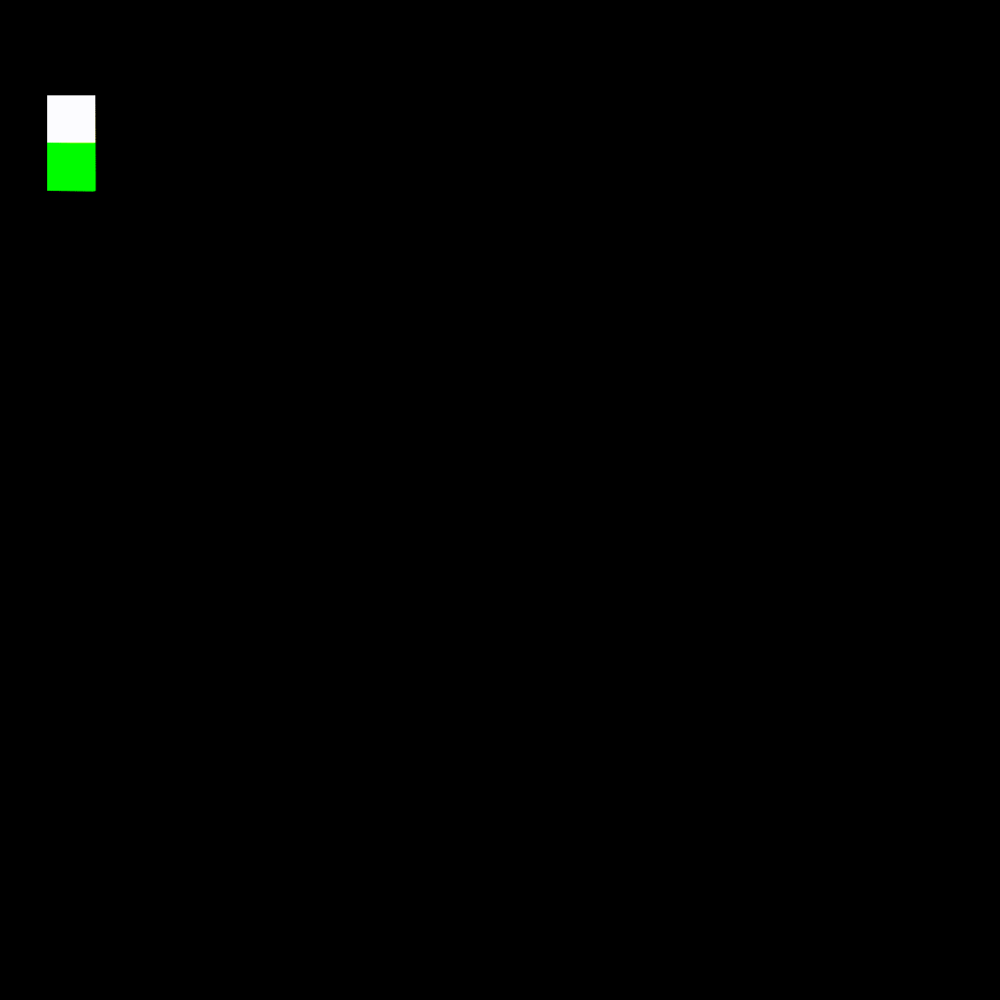

# Maze DUKS

## Introduction

The Maze DUCKS game is a single player third person perspective puzzle game, where the primary objective of the player is to reach the end of the maze.

The Maze itself and all playable elements are made using JAVA and it’s subsidiaries. 

Machine Learning is used in order to create finer aspects of the game such as adaptive difficulty.

The game can be played in various modes, each with different objectives and strategies.

An SQL-based database is used to store the player’s information and their records.

The fundamental objective of the Maze DUCKS game is to provide an entertaining experience that stimulates the player’s prefrontal cortex, to give one better problem solving skills and time based adaptiveness.

## Code Details 

Netbeans is used to create the Project so it can directly be run when using Netbeans 8.

## Screenshots

The classic mode with tunnel vision:    

The classic mode:    

The arcade mode:    

The timed mode with tunnel vision:    

